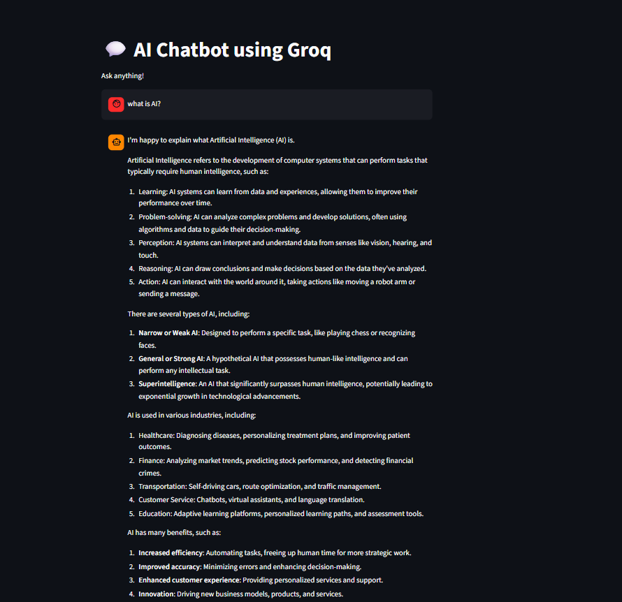

# 💬 AI Chatbot using Groq API

## 🚀 Project Overview
Built an AI chatbot using Groq API and LLaMA 3 model with real-time response generation. Implemented chat memory, system prompts, and interactive UI using Streamlit. Applied best practices like environment variable management and error handling.

This project is an AI-powered chatbot built using the Groq API and LLaMA 3 model. It allows users to interact with an intelligent assistant that provides real-time, context-aware responses.

The chatbot includes memory, a clean UI, and follows best practices like environment variable handling for security.

---

## 🎯 Features

* 🤖 AI-powered chatbot using Groq API
* 🧠 Chat history (context-aware responses)
* 🎭 System prompt for controlled AI behavior
* 💻 Interactive UI using Streamlit
* 🔒 Secure API key management using `.env`
* ⚠️ Error handling for reliability
* 🗑️ Clear chat functionality

---

## 🛠️ Tech Stack

* Python
* Groq API (LLM - LLaMA 3)
* Streamlit
* python-dotenv

---

## 📂 Project Structure

```
groq-chatbot/
│
├── app.py
├── requirements.txt
├── .gitignore
└── README.md
```

## 💡 How It Works

1. User enters a message
2. Message is stored in session state (chat history)
3. Request is sent to Groq API
4. AI generates response using LLaMA model
5. Response is displayed in chat UI

---

## 📸 Screenshots

(Add your app screenshot here)


---

